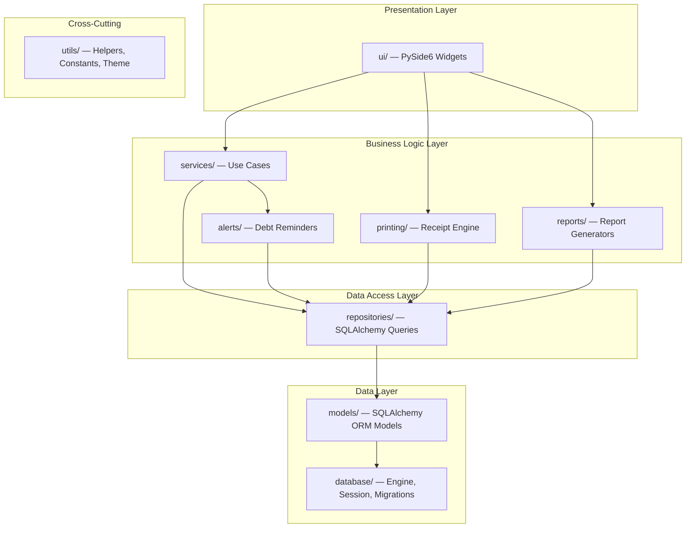
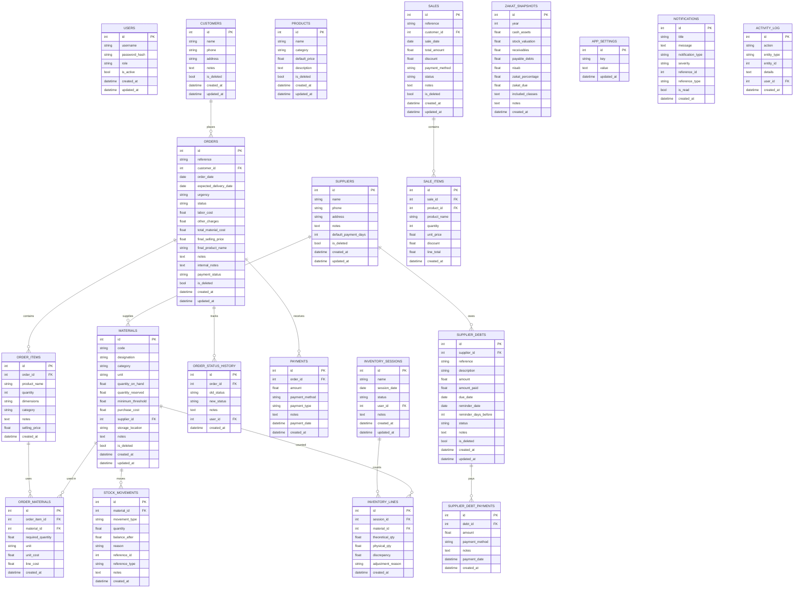
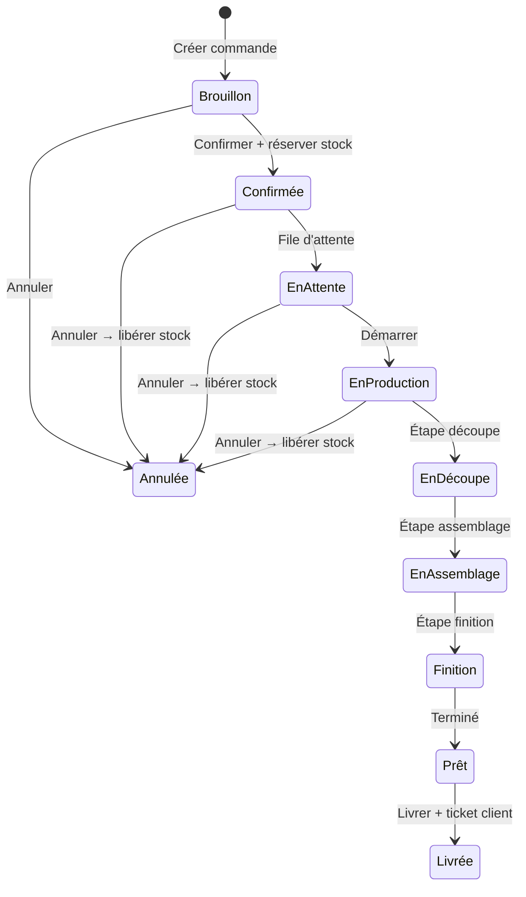
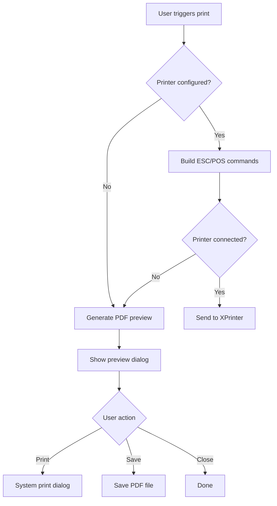
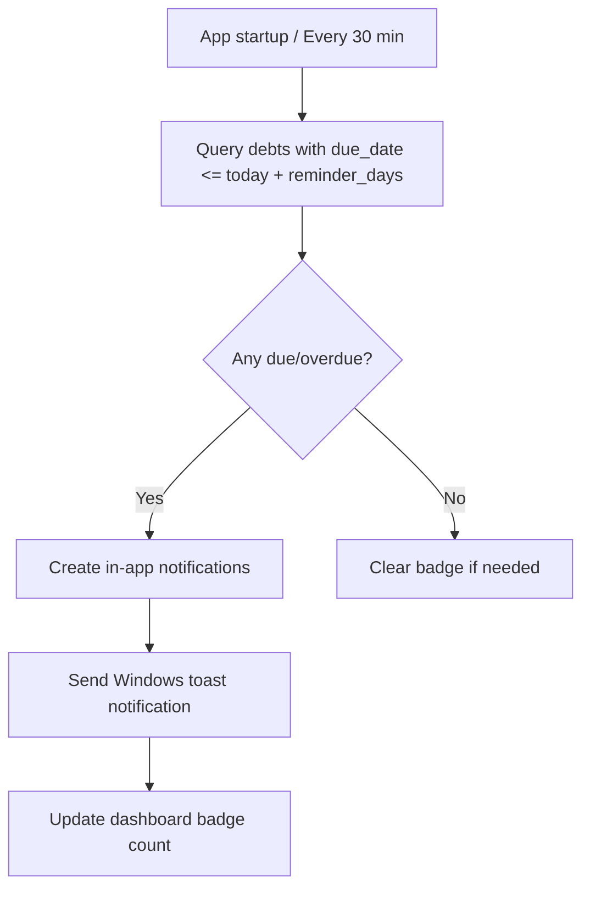

# MiroirPro — Implementation Plan

> Desktop business management application for a mirror/armoire workshop.
> **Tech**: Python 3.12+ · PySide6 · SQLite · SQLAlchemy · PyInstaller

---

## 1. Architecture



**Pattern**: Layered architecture with strict dependency direction (UI → Services → Repositories → Models/DB). No layer skipping.

**Key principles**:
- UI never touches SQLAlchemy sessions directly
- Services own all business logic and transactions
- Repositories encapsulate all queries
- Models are pure data definitions
- Printing/Reports/Alerts are specialized service modules

---

## 2. Folder Structure

```
desktopapp/
├── main.py                    # Entry point
├── requirements.txt
├── README.md
├── build.spec                 # PyInstaller spec
├── .env.example
├── app/
│   ├── __init__.py
│   ├── config.py              # App configuration
│   ├── database/
│   │   ├── __init__.py
│   │   ├── engine.py          # SQLAlchemy engine & session factory
│   │   ├── base.py            # Declarative base
│   │   └── seed.py            # Sample data seeder
│   ├── models/
│   │   ├── __init__.py
│   │   ├── user.py
│   │   ├── customer.py
│   │   ├── supplier.py
│   │   ├── material.py
│   │   ├── product.py
│   │   ├── order.py
│   │   ├── sale.py
│   │   ├── stock.py
│   │   ├── inventory.py
│   │   ├── debt.py
│   │   ├── payment.py
│   │   ├── zakat.py
│   │   ├── notification.py
│   │   └── settings.py
│   ├── repositories/
│   │   ├── __init__.py
│   │   ├── base_repository.py
│   │   ├── customer_repository.py
│   │   ├── supplier_repository.py
│   │   ├── material_repository.py
│   │   ├── order_repository.py
│   │   ├── sale_repository.py
│   │   ├── stock_repository.py
│   │   ├── inventory_repository.py
│   │   ├── debt_repository.py
│   │   ├── payment_repository.py
│   │   ├── zakat_repository.py
│   │   ├── notification_repository.py
│   │   └── settings_repository.py
│   ├── services/
│   │   ├── __init__.py
│   │   ├── order_service.py       # Order creation, costing, stock reservation
│   │   ├── stock_service.py       # Stock movements, reservation logic
│   │   ├── sale_service.py        # POS transactions
│   │   ├── supplier_service.py    # Supplier & debt management
│   │   ├── payment_service.py     # Customer payments & deposits
│   │   ├── inventory_service.py   # Physical count sessions
│   │   ├── zakat_service.py       # Zakat calculation engine
│   │   ├── dashboard_service.py   # Dashboard aggregations
│   │   ├── settings_service.py    # App settings CRUD
│   │   └── activity_service.py    # Activity log
│   ├── printing/
│   │   ├── __init__.py
│   │   ├── printer_manager.py     # Printer discovery & connection
│   │   ├── escpos_builder.py      # ESC/POS command builder
│   │   ├── receipt_templates.py   # All receipt/ticket templates
│   │   └── pdf_fallback.py        # PDF preview when no printer
│   ├── reports/
│   │   ├── __init__.py
│   │   ├── report_engine.py       # Report generation logic
│   │   ├── pdf_generator.py       # PDF export
│   │   └── csv_exporter.py        # CSV export
│   ├── alerts/
│   │   ├── __init__.py
│   │   ├── alert_scheduler.py     # Periodic debt check
│   │   ├── notification_service.py # In-app + Windows notifications
│   │   └── windows_notifier.py    # Windows toast notifications
│   ├── ui/
│   │   ├── __init__.py
│   │   ├── main_window.py         # Main window with sidebar
│   │   ├── theme.py               # Dark/Light theme system
│   │   ├── styles.py              # QSS stylesheets
│   │   ├── icons.py               # Icon registry
│   │   ├── components/            # Reusable UI components
│   │   │   ├── __init__.py
│   │   │   ├── sidebar.py
│   │   │   ├── header.py
│   │   │   ├── search_bar.py
│   │   │   ├── data_table.py
│   │   │   ├── status_badge.py
│   │   │   ├── stat_card.py
│   │   │   ├── chart_widget.py
│   │   │   ├── empty_state.py
│   │   │   ├── confirm_dialog.py
│   │   │   ├── form_fields.py
│   │   │   └── notification_bell.py
│   │   └── pages/
│   │       ├── __init__.py
│   │       ├── dashboard_page.py
│   │       ├── pos_page.py
│   │       ├── orders_page.py
│   │       ├── order_detail_page.py
│   │       ├── stock_page.py
│   │       ├── inventory_page.py
│   │       ├── suppliers_page.py
│   │       ├── supplier_detail_page.py
│   │       ├── reports_page.py
│   │       ├── zakat_page.py
│   │       └── settings_page.py
│   └── utils/
│       ├── __init__.py
│       ├── constants.py           # Enums, status codes, labels
│       ├── formatters.py          # Currency, date, number formatting
│       ├── validators.py          # Input validation
│       └── backup.py              # Database backup utility
├── tests/
│   ├── __init__.py
│   ├── test_order_costing.py
│   ├── test_stock_reservation.py
│   ├── test_debt_reminders.py
│   └── test_payment_balance.py
├── assets/
│   ├── icons/                     # SVG icons
│   └── fonts/                     # Inter font family
└── data/
    └── miroir_pro.db              # Runtime SQLite database
```

---

## 3. Database Schema



### Key Schema Decisions

| Decision | Choice | Rationale |
|----------|--------|-----------|
| Stock valuation | Latest purchase cost | Simpler, accurate for small workshop |
| Soft delete | `is_deleted` flag on key entities | Preserve audit trail |
| Order reference | Auto-generated `CMD-YYYYMMDD-NNN` | Human-readable, sortable |
| Sale reference | Auto-generated `VNT-YYYYMMDD-NNN` | Same pattern |
| Available stock | Computed: `on_hand - reserved` | Not stored, always calculated |

---

## 4. Libraries

| Library | Version | Purpose |
|---------|---------|---------|
| PySide6 | 6.7+ | Desktop UI framework |
| SQLAlchemy | 2.0+ | ORM & database |
| python-escpos | 3.1+ | ESC/POS thermal printing |
| reportlab | 4.0+ | PDF generation |
| matplotlib | 3.8+ | Charts in dashboard/reports |
| Pillow | 10+ | Image handling for logos/receipts |
| winotify | 1.1+ | Windows toast notifications |
| pyinstaller | 6.0+ | Windows packaging |
| pytest | 8.0+ | Unit testing |

**requirements.txt**:
```
PySide6>=6.7.0
SQLAlchemy>=2.0.0
python-escpos>=3.1.0
reportlab>=4.0.0
matplotlib>=3.8.0
Pillow>=10.0.0
winotify>=1.1.0
pyinstaller>=6.0.0
pytest>=8.0.0
```

---

## 5. Screen List

| # | Screen | Route/Key | Type |
|---|--------|-----------|------|
| 1 | Tableau de bord | `dashboard` | Full page |
| 2 | POS / Vente directe | `pos` | Full page |
| 3 | Commandes (liste) | `orders` | Full page |
| 4 | Détail commande | `order_detail` | Full page with tabs |
| 5 | Nouvelle commande | `order_new` | Modal / drawer |
| 6 | Stock (liste) | `stock` | Full page |
| 7 | Nouvelle matière | `material_new` | Modal |
| 8 | Mouvement stock | `stock_movement` | Modal |
| 9 | Inventaire (sessions) | `inventory` | Full page |
| 10 | Session d'inventaire | `inventory_session` | Full page |
| 11 | Fournisseurs & Dettes | `suppliers` | Full page |
| 12 | Détail fournisseur | `supplier_detail` | Full page with tabs |
| 13 | Nouvelle dette | `debt_new` | Modal |
| 14 | Rapports | `reports` | Full page |
| 15 | Zakat | `zakat` | Full page |
| 16 | Paramètres | `settings` | Full page with tabs |

---

## 6. Order Workflow



### Order Lifecycle Steps

1. **Brouillon** — Owner creates order, adds items & materials. No stock reserved.
2. **Confirmée** — Owner confirms. Stock reservation happens atomically in a DB transaction.
3. **En attente → En production → sub-stages** — Progress tracking. Owner can still edit materials (reservation recalculated).
4. **Prêt** — Owner enters final product name, final selling price, prints customer ticket.
5. **Livrée** — Final delivery. All payments settled.
6. **Annulée** — At any stage. Releases all reserved stock atomically.

---

## 7. Printing Workflow



### Receipt Types

| Receipt | Trigger | Content | Audience |
|---------|---------|---------|----------|
| Internal cost ticket | Material selection done | Materials, costs, urgency | Owner only |
| Customer receipt | Order marked done | Product name, price, payments | Customer |
| Payment receipt | Payment registered | Payment details, balance | Customer |
| POS receipt | POS sale completed | Items, total, payment | Customer |

### Thermal Printer Config
- Paper width: 58mm (32 chars) or 80mm (48 chars)
- Encoding: CP437 / CP850 for French accents
- Commands: ESC/POS standard (cut, bold, align, barcode)

---

## 8. Stock Reservation Logic

```python
# Pseudocode for stock reservation
def confirm_order(order_id):
    with db.transaction():
        order = get_order(order_id)
        
        for item in order.items:
            for om in item.order_materials:
                material = om.material
                
                # Check availability
                available = material.quantity_on_hand - material.quantity_reserved
                if om.required_quantity > available:
                    raise InsufficientStockError(material, available, om.required_quantity)
                
                # Reserve
                material.quantity_reserved += om.required_quantity
                
                # Log movement
                create_stock_movement(
                    material_id=material.id,
                    type='reservation',
                    quantity=om.required_quantity,
                    reference_type='order',
                    reference_id=order.id
                )
        
        order.status = 'confirmée'
        log_status_change(order, 'brouillon', 'confirmée')

def cancel_order(order_id):
    with db.transaction():
        order = get_order(order_id)
        
        for item in order.items:
            for om in item.order_materials:
                material = om.material
                material.quantity_reserved -= om.required_quantity
                
                create_stock_movement(
                    material_id=material.id,
                    type='release',
                    quantity=-om.required_quantity,
                    reference_type='order_cancel',
                    reference_id=order.id
                )
        
        order.status = 'annulée'

def update_order_materials(order_id, new_materials):
    with db.transaction():
        # Release all current reservations
        release_all_reservations(order_id)
        
        # Apply new material list
        set_order_materials(order_id, new_materials)
        
        # Re-reserve if order is confirmed+
        if order.status in RESERVED_STATUSES:
            reserve_all_materials(order_id)
```

### Invariants
- `quantity_available = quantity_on_hand - quantity_reserved` (always computed, never stored)
- `quantity_reserved >= 0` always
- `quantity_on_hand` changes only on: stock_in, stock_out, adjustment, POS sale
- `quantity_reserved` changes only on: order confirm, order edit, order cancel

---

## 9. Supplier Debt Alert Logic



### Alert Categories

| Category | Condition | Severity | Color |
|----------|-----------|----------|-------|
| Upcoming | due_date - today <= reminder_days | Info | Blue |
| Due today | due_date == today | Warning | Orange |
| Overdue | due_date < today & remaining > 0 | Danger | Red |

### Implementation
- **QTimer** in main window: checks every 30 minutes
- **Startup check**: immediate scan on app launch
- **Windows toast**: via `winotify` library
- **In-app**: notification bell in header with badge count
- **Dashboard**: dedicated card showing overdue/upcoming debts

---

## 10. Packaging Strategy for Windows

```
PyInstaller one-folder mode:
  pyinstaller build.spec

Output:
  dist/MiroirPro/
  ├── MiroirPro.exe
  ├── data/              # SQLite DB location
  ├── assets/            # Icons, fonts
  └── [bundled deps]
```

### PyInstaller Configuration
- **Mode**: `--onedir` (faster startup than `--onefile`)
- **Hidden imports**: SQLAlchemy dialects, PySide6 plugins
- **Data files**: assets/, fonts/, default DB
- **Icon**: Custom .ico file
- **Console**: `--noconsole` (windowed mode)
- **Name**: `MiroirPro`

### Runtime Data Path
- DB stored in `AppData/Local/MiroirPro/` or beside the exe in `data/`
- Config and backups in same location
- Portable mode option: keep everything next to exe

---

## 11. Design System

### Color Palette

| Token | Light | Dark | Usage |
|-------|-------|------|-------|
| `bg-primary` | `#FFFFFF` | `#1A1B2E` | Main background |
| `bg-secondary` | `#F8F9FC` | `#232440` | Cards, sidebar |
| `bg-tertiary` | `#EEF0F6` | `#2D2E4A` | Hover, inputs |
| `accent` | `#6366F1` | `#818CF8` | Primary actions |
| `accent-hover` | `#4F46E5` | `#6366F1` | Hover state |
| `success` | `#10B981` | `#34D399` | Paid, delivered |
| `warning` | `#F59E0B` | `#FBBF24` | Urgent, due soon |
| `danger` | `#EF4444` | `#F87171` | Overdue, cancelled |
| `text-primary` | `#1E293B` | `#F1F5F9` | Main text |
| `text-secondary` | `#64748B` | `#94A3B8` | Secondary text |

### Typography
- **Font**: Inter (bundled)
- **Sizes**: 12px body, 14px tables, 16px subheadings, 20px headings, 28px page titles
- **Weight**: 400 regular, 500 medium, 600 semi-bold, 700 bold

### Spacing
- Base unit: 4px
- Card padding: 16–24px
- Section gap: 24px
- Sidebar width: 240px
- Header height: 56px

---

## 12. Formulas

| Calculation | Formula |
|-------------|---------|
| Material line cost | `required_quantity × unit_cost` |
| Item material cost | `Σ line_costs` for all materials on item |
| Order material cost | `Σ item_material_costs` |
| Estimated cost price | `order_material_cost + labor_cost + other_charges` |
| Estimated profit | `final_selling_price - estimated_cost_price` |
| Order balance | `final_selling_price - Σ payments` |
| Debt balance | `debt_amount - Σ debt_payments` |
| Stock valuation | `Σ (quantity_on_hand × latest_purchase_cost)` for all materials |
| Zakat due | `(eligible_assets - nisab) × zakat_percentage` if eligible > nisab |

---

## Verification Plan

### Automated Tests
```bash
pytest tests/ -v
```
- `test_order_costing.py` — material cost, profit calculation
- `test_stock_reservation.py` — reserve, release, edit, negative stock prevention
- `test_debt_reminders.py` — due date detection, alert generation
- `test_payment_balance.py` — deposit, multiple payments, remaining balance

### Manual Verification
- Launch app, navigate all 9 sidebar pages
- Create order → add materials → confirm → verify stock changes
- Print preview for all 4 receipt types
- Create supplier debt → set due date → verify alert appears
- Run POS sale → verify stock deduction
- Check dashboard charts populate with seed data
- Toggle dark/light theme
- Build with PyInstaller and run the .exe

---

## Proposed Implementation Order

| Phase | What | Est. Files |
|-------|------|-----------|
| 1 | Project scaffold, config, DB engine, models | ~20 |
| 2 | Seed data, base repository | ~5 |
| 3 | Shell app: main window, sidebar, theme, empty pages | ~15 |
| 4 | Reusable UI components (table, badge, card, chart, form) | ~12 |
| 5 | Stock module (full CRUD + movements) | ~6 |
| 6 | Orders module (full workflow + costing + reservation) | ~10 |
| 7 | Printing service + preview | ~5 |
| 8 | POS module | ~4 |
| 9 | Suppliers & debts + alerts | ~6 |
| 10 | Dashboard with charts | ~3 |
| 11 | Reports + export | ~4 |
| 12 | Inventory module | ~4 |
| 13 | Zakat page | ~3 |
| 14 | Settings page | ~3 |
| 15 | Unit tests | ~4 |
| 16 | PyInstaller build + README | ~3 |

> **Total**: ~107 files, built incrementally with the app runnable after Phase 3.
